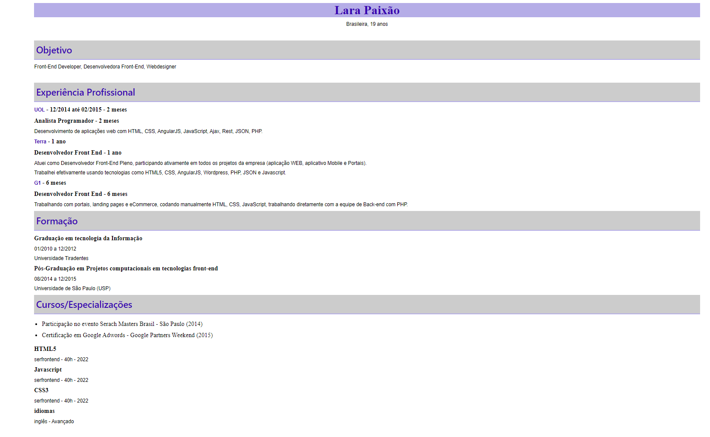

# Segundo desafio de currículo
> O segundo desafio do curso de Webfrontend para criação de um modelo de currículo em HTML com estilização em CSS.

Modelo útil para construir um currículo organizado com HTML5 e CSS3 , com tópicos objetivos e de fácil visualização para o empregador.

## Meta

Lara Paixão - [@Linkedin](https://www.linkedin.com/in/larapaixao/) - lara.paixao.nascimento@gmail.com

Distribuído sobre a licença. Veja `LICENÇA` para mais informações.

[GitHub](https://github.com/LPaixao18)
